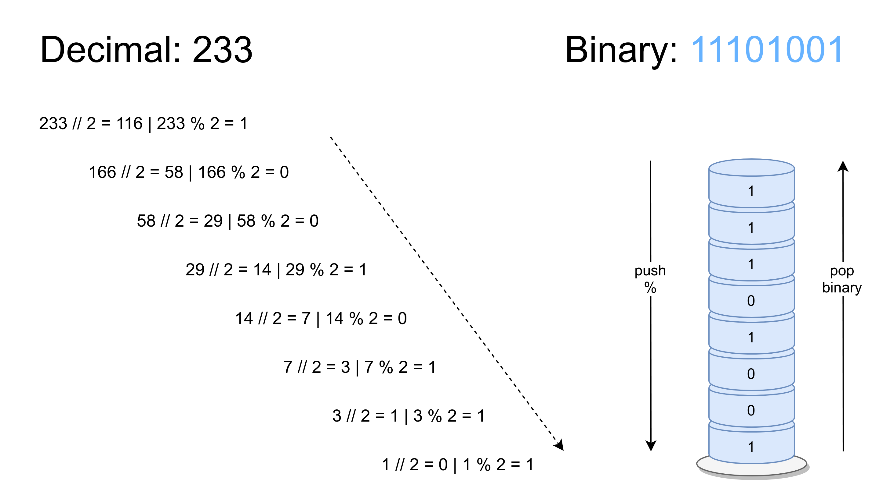

ADT Stack Template
===

Este repositório consiste num projeto **IntelliJ** 
de suporte à lecionação dos tipos abstratos de dados na linguagem Java,
no contexto da unidade curricular de *Programação Avançada* - ESTSetúbal.

Os exercícios solicitados são os seguintes:

## ADT Stack | Exercícios de implementação

1. Faça *clone* deste projeto base **ADTStack_Template** (projeto **IntelliJ**) do *GitHub*:

2. Forneça a documentação *Javadoc* para a interface `Stack` da forma mais completa possível (interface e métodos).

	- Ver: https://www.oracle.com/technical-resources/articles/java/javadoc-tool.html

3. Forneça a documentação para a classe `StackArrayList`, sabendo que utiliza uma estrutura de dados baseada em *array* (da classe e atributos; a documentação dos métodos da interface é herdada).

4. Forneça o código dos métodos por implementar, i.e., os que estão a lançar `NotImplementedException`; 

5. Compile e teste o programa fornecido, verificando que os resultados são os esperados; a excepção deverá ser capturada apropriadamente.

6. Modifique o método `push()` para aumentar dinamicamente o array `elements` sempre que necessário. Compile e teste novamente o programa; a excepção não deverá ocorrer.

7. Pretende-se uma diferente implementação baseada em *lista (simplesmente) ligada* na classe `StackLinkedList`. A definição de um nó é fornecida na *inner class* `Node`.

```java
public class StackLinkedList<T> implements Stack<T> {
	private Node top; //sentinela
	private int size;

	public StackLinkedList() {
		this.top = new Node(null, null);
		this.size = 0;
	}

	private class Node { //inner class, só reconhecida neste contexto
		private T element;
		private Node next;
		public Node(T element, Node next) {
			this.element = element;
			this.next = next;
		}
	}
}
```

8. Substitua a implementação de `Stack` utilizada no método `main()` por uma instância da classe anterior. Compile e teste o programa verificando que o comportamento do programa se mantém inalterado.

9. Quais as complexidades algorítmicas para as operações `push()` e `pop()` nas duas implementações obtidas?

10. (**Extra**) Para efeitos meramente pedagógicos, remova o atributo `size` da classe `StackLinkedList` e adapte o código existente para o tornar funcional. 


## ADT Stack | Exercícios de utilização

Um programa deverá solicitar um número ao utilizador, e.g., 233 e apresentar esse número em binário. O algoritmo divide sucessivamente o número por 2 (divisão inteira) até zero e guarda numa pilha o resto das divisões – ver figura. O número em binário é obtido removendo todos os elementos da pilha, i.e., pela ordem de saída. 




1. Crie uma classe `DecimalToBinary` contendo um método `main`; implemente o algoritmo solicitado no método:

    > `public static String decimal2Binary(int decimal)`

2. No método `main` crie o programa que solicita ao utilizador um número decimal e apresente a sua representação em binário; invoque o método anterior.
